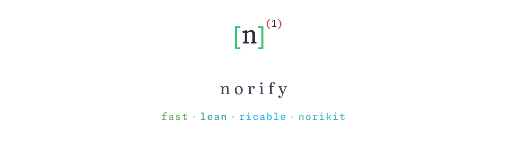

  
  
  

  <picture>
    <source media="(prefers-color-scheme: dark)" srcset="assets/hero-dark.svg"/>
    <source media="(prefers-color-scheme: light)" srcset="assets/hero-light.svg"/>
    
  </picture>

  A notification engine for the <strong>norikit</strong> ecosystem. 
  It handles notification events and integrates them with the rest of the tooling.

> [!NOTE]
> Work in progress. norify is in early development and not yet usable.

## License

norify is licensed under the [GNU AGPL-3.0](LICENSE).
